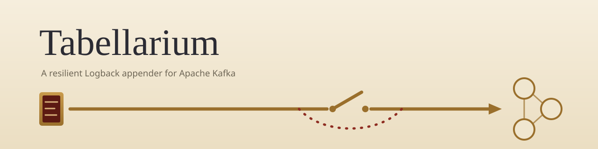

<picture>
  <source media="(prefers-color-scheme: dark)" srcset="docs/assets/banner-dark.svg">
  <source media="(prefers-color-scheme: light)" srcset="docs/assets/banner-light.svg">
  
</picture>

# Tabellarium

[](https://github.com/Inqudium/tabellarium/actions/workflows/ci.yml)
[](LICENSE)
[](https://openjdk.org/projects/jdk/21/)
[](https://kotlinlang.org/)
[](https://github.com/Inqudium/tabellarium/commits/main)
[](https://github.com/Inqudium/tabellarium/issues)

Tabellarium is a resilient Logback appender that ships structured log events to
Apache Kafka. Named after the Roman letter-carrier, it never blocks the sender:
per-topic-class circuit breakers stop hammering a broken route, mandatory
overrides seal audit-grade delivery (acks=all, idempotence), and a fallback
appender catches what cannot be shipped.

## The name

*Tabellarium* is named after the **tabellarius**, the letter-carrier of the Roman world.
His load was the *tabella* — a wax tablet, a small written record of fixed form — and his
craft was not writing but *delivery*: taking the tablet off the sender's hands at the
door, and getting it to its destination even when the usual road was closed.

That is precisely this project's job, transposed to logging. Every log event is a
tabella — one encoded, structured record — and the appender is the carrier that accepts
it at the moment of logging and delivers it to Kafka. The craft lies in *how* it
carries: the **sender is never made to wait** (the hot path takes no lock, and the
delivery outcome is reported asynchronously through the send callback), a **broken road
is not hammered** (a circuit breaker per topic class suspends dispatch while the route
is down), and an undeliverable tablet takes the **side road rather than the ditch** (the
fallback appender). Dispatches of rank travel under stricter carriage rules the sender
cannot waive: the mandatory overrides of the AUDIT class — `acks=all`, idempotence — are
the seal the carrier applies whatever the configuration asked for. The name deliberately
refers to the carrier, not the road: Kafka is route and destination, the broker
infrastructure someone else operates; Tabellarium is only ever the one carrying.

The form follows the naming of chemical elements. Real elements take their names from
places, figures and ideas — rhenium after the Rhine, promethium after a myth — and
*tabellarius* + the element suffix *-ium* yields a plausible entry in that series. This
places Tabellarium in the same fictional periodic table as **Inqudium** (the
`eu.inqudium` group it is published under) and **Limesium**: an element-style name for
one well-defined capability, here the element of reliable carriage. The two neighbours
even share a story — Limesium is the watchtower that records each crossing at the
service's own boundary; Tabellarium is the courier who carries the records away.

## Quick start

1. Declare the appender in your `logback-spring.xml`:

   ```xml
   <appender name="KAFKA" class="eu.inqudium.tabellarium.KafkaAppender">
   ```

2. Fill in the required elements — see [Configuration](#configuration)
   and the complete example at
   [`docs/config/example-logback-spring.xml`](docs/config/example-logback-spring.xml).

3. Optionally add a fallback appender (recommended) — see
   [Resilience](#resilience) below.

4. Deploy.

## Configuration

A complete configuration example lives at
[`docs/config/example-logback-spring.xml`](docs/config/example-logback-spring.xml).
Reference for every supported element:

| Element                      | Required | Type    | Notes                                                                              |
|------------------------------|----------|---------|------------------------------------------------------------------------------------|
| `<encoder>`                  | Yes      | nested  | Standard Logback encoder. `LogstashEncoder` recommended.                           |
| `<kafkaProducerProperties>`  | Yes      | text    | Multi-line `key=value` Kafka producer config. Comments with `#` supported.         |
| `<topicMapping>`             | Yes      | nested  | Currently supports only `<defaultTopic>` — see [Extension points](#extension-points). |
| `<environment>`              | Yes      | string  | Deployment environment (e.g. `prod`, `staging`).                                   |
| `<component>`                | Yes      | string  | Service component identifier (typically `${spring.application.name}`).             |
| `<cmdbId>`                   | Yes      | string  | CMDB identifier of the deploying instance.                                         |
| `<debug>`                    | No       | boolean | Startup diagnostics only: logs the active topic classes and fallback configuration to Logback's status manager. No per-event effect. |
| `<appender-ref ref="..."/>`  | No       | ref     | Single fallback appender — see [Resilience](#resilience).                          |

Missing or blank values for the five required elements cause the
appender to refuse startup with an explicit `addError` on Logback's
status manager. The error message identifies which element is missing.

## Mandatory override policy (compliance)

A single Kafka producer shared by every topic would mean an audit
topic and a debug topic share the same `acks` value — and if the
operator configured `acks=1` for throughput, audit records could
silently be lost on a Kafka leader failover.

This module classifies every topic into one of four classes and
enforces per-class producer configuration:

| Class       | Durability  | Mandatory overrides                              | Use case                          |
|-------------|-------------|--------------------------------------------------|-----------------------------------|
| AUDIT       | Maximum     | `acks=all`, `enable.idempotence=true`            | BaFin/MaRisk-relevant audit logs  |
| FUNCTIONAL  | Maximum     | `acks=all`                                       | Operationally important logs      |
| TECHNICAL   | Best-effort | (none — operator-tunable)                        | Debug and diagnostic logs         |
| PERFORMANCE | Best-effort | (none — operator-tunable)                        | High-volume metric logs           |

A **mandatory override** is non-negotiable: if the operator's
`<kafkaProducerProperties>` specifies `acks=1` for an audit topic, the
appender forces `acks=all` at startup and emits a status warning naming
the property, the operator-supplied value, and the enforced value.
Auditors and operators see the override in the Logback startup log:

```
WARN  Mandatory override applied for AUDIT: acks forced from '1' to 'all'.
      This is a compliance requirement; see TopicClass.AUDIT for rationale.
```

The current minimal configuration (only `<defaultTopic>`) results in
all topics being treated as TECHNICAL — no mandatory overrides apply.
The compliance differentiation activates as soon as
[marker mappings](#extension-points) are introduced.

## Resilience

Three resilience mechanisms run independently per topic class:

1. **Per-class circuit breaker.** A Resilience4j `CircuitBreaker` is
   instantiated per active topic class. A stuck audit-topic broker does
   not throttle technical-log delivery, and vice versa. Default
   thresholds (tuned for logging volume): 50% failure rate over a
   sliding window of 20 calls, 30 second cooldown in open state, 3
   probe calls in half-open. Operators can override per class by
   pre-registering a `CircuitBreakerConfig` under the name
   `kafka-appender-audit` / `-functional` / `-technical` / `-performance`
   on the registry.

2. **Asynchronous delivery with callback-driven outcome tracking.**
   Kafka's `producer.send` is invoked with a callback that feeds the
   circuit breaker (`onSuccess` / `onError`). The `Future` returned by
   `send` is deliberately not retained — the callback is the single
   source of truth for delivery outcome, so delivery failures are
   never invisible.

3. **Fallback appender.** When the circuit is open or a send fails
   synchronously, the original `ILoggingEvent` is routed to the
   configured fallback appender. Standard Logback `<appender-ref>`
   syntax is supported:

   ```xml
   <appender name="KAFKA_FALLBACK_FILE" class="ch.qos.logback.core.FileAppender">
     <file>/var/log/myapp/kafka-fallback.log</file>
     <encoder>...</encoder>
   </appender>

   <appender name="KAFKA" class="eu.inqudium.tabellarium.KafkaAppender">
     ...
     <appender-ref ref="KAFKA_FALLBACK_FILE"/>
   </appender>
   ```

   When no fallback is configured, records are silently dropped on
   failure. This is the deliberate operator choice: configuring a
   fallback says "loss is unacceptable here"; leaving it out says
   "best-effort is fine".

## Should I wrap this in a Logback `AsyncAppender`?

**Short answer: no.** A common pattern with Kafka appenders is to
wrap them in `ch.qos.logback.classic.AsyncAppender` to keep
application threads from blocking on Kafka I/O. This module makes
that pattern unnecessary and, with default `AsyncAppender` settings,
counterproductive.

### Why it is not needed

`AsyncAppender` exists to absorb caller-thread blocking. This module
already mitigates caller-thread blocking through three layered
defenses:

1. **`max.block.ms` is forced to 500 ms** per topic class. Worst-case
   block per `send()` is now bounded at half a second.
2. **The circuit breaker trips after ~10 failures** (50% failure rate
   in a 20-call sliding window). Once open, subsequent events are
   routed to the fallback in O(1).
3. **The fallback uses an asynchronous `FallbackDispatcher`** — a
   bounded queue with its own daemon worker, so the Kafka I/O thread
   and the application threads are never held hostage by a slow
   fallback appender (e.g. a `FileAppender` on saturated disk).

Cumulative worst case for a service whose Kafka cluster has just gone
down: ~10 events × 500 ms = 5 seconds of total caller-thread latency
spread across however many threads are logging, after which the
breaker is open and every event takes microseconds again.

### Why wrapping in `AsyncAppender` now hurts

Wrapping in `AsyncAppender` with its default settings introduces
**worse** loss semantics than this module's built-in mechanisms:

- **`neverBlock=false` (the default) is a trap.** When the
  `AsyncAppender` queue (`queueSize=256` by default) fills up,
  `doAppend` blocks the caller — defeating the entire point of using
  the wrapper. The 500 ms `max.block.ms` protection is bypassed
  because the wait happens in the queue offer, not in `producer.send`.
- **`discardingThreshold=queueSize/5` (the default) silently drops
  INFO/DEBUG/TRACE** once the queue is 80% full. These dropped events
  do not reach the fallback appender; they vanish.
- **`AsyncAppender` adds an extra thread, an extra queue, and extra
  indirection** between the application and the appender for no
  benefit this module does not already provide.

### Recommendation

Use the `KafkaAppender` directly:

```xml
<appender name="KAFKA" class="eu.inqudium.tabellarium.KafkaAppender">
    ...
    <appender-ref ref="KAFKA_FALLBACK_FILE"/>
</appender>

<root level="INFO">
    <appender-ref ref="KAFKA"/>
</root>
```

If an existing `logback-spring.xml` wraps the Kafka appender in an
`AsyncAppender`, drop the wrapper:

```diff
- <appender name="ASYNC_KAFKA" class="ch.qos.logback.classic.AsyncAppender">
-   <appender-ref ref="KAFKA"/>
- </appender>
- <root level="INFO">
-   <appender-ref ref="ASYNC_KAFKA"/>
- </root>
+ <root level="INFO">
+   <appender-ref ref="KAFKA"/>
+ </root>
```

### When `AsyncAppender` is still justified

Sub-100 ms hard latency SLAs that cannot tolerate the 500 ms
worst-case spike before the breaker trips — typical of trading,
real-time risk, or other latency-critical paths. In that case, use
`AsyncAppender` with these non-default settings:

```xml
<appender name="ASYNC_KAFKA" class="ch.qos.logback.classic.AsyncAppender">
    <appender-ref ref="KAFKA"/>
    <queueSize>2048</queueSize>
    <discardingThreshold>0</discardingThreshold>
    <neverBlock>true</neverBlock>
    <includeCallerData>false</includeCallerData>
</appender>
```

Be aware that `neverBlock=true` drops events silently without routing
them to the fallback — a weaker loss guarantee than the appender's
built-in resilience.

## Reactive applications

This module is safe to use in Reactor-Netty / WebFlux services and
in code that runs on JDK virtual threads. The largest reactive
hazard — `synchronized` blocks in the appender hot path, which cause
carrier-thread pinning on virtual threads and Reactor-Netty
event-loop stalls — does not arise: the appender extends
`UnsynchronizedAppenderBase`. There are no locks in the hot path;
only atomics and volatiles.

Two reactive-specific concerns remain that are worth tuning per
service.

### `max.block.ms` is the one realistic block point

`KafkaProducer.send()` is asynchronous per the Kafka spec, but it
can synchronously block for up to `max.block.ms` when the producer
buffer is full, metadata is stale, or buffer allocation contends
with other producers. The class-default for AUDIT/FUNCTIONAL/
TECHNICAL is `500 ms` — a reasonable value for traditional
servlet-thread pools but **long for a Reactor event loop** where
only a handful of event-loop threads serve all requests.

For a reactive service, override the value in
`<kafkaProducerProperties>`:

```xml
<kafkaProducerProperties>
    bootstrap.servers=...
    max.block.ms=50
</kafkaProducerProperties>
```

Trade-off: with 50 ms the producer drops to the fallback earlier
under transient buffer pressure (not a cluster outage, just a brief
backlog). This is the intended use of the fallback. The circuit
breaker still trips after roughly 10 failures, after which all
further events route to the fallback in O(1) regardless of
`max.block.ms`.

This is the only setting that should typically differ between
servlet and reactive services. Everything else (`acks`,
`enable.idempotence`, `linger.ms`) is decided by topic class.

### BlockHound

Services that run BlockHound (`io.projectreactor.tools:blockhound`)
in their integration tests will see the appender's internal
operations flagged as blocking — most notably the
`LinkedBlockingQueue.offer()` in the [FallbackDispatcher] and the
internals of `KafkaProducer.send()`. These are not true blocks in
the harmful sense (the queue offer is non-blocking on a non-full
queue; the producer send is the operator's accepted
`max.block.ms` budget), but BlockHound's heuristics don't know
that.

Add an allow-list entry in the test setup:

```kotlin
BlockHound.builder()
    .allowBlockingCallsInside(
        "ch.qos.logback.classic.Logger", "callAppenders"
    )
    .allowBlockingCallsInside(
        "eu.inqudium.tabellarium.KafkaAppender", "append"
    )
    .install()
```

This declares that logging calls are an accepted block point in the
service's contract — which they have to be, regardless of which
appender is used.

### MDC propagation for the partitioning key

The default partitioning-key extractor reads `traceId` from the MDC
at the moment of the `log.info(...)` call. Logback freezes the MDC
into the `ILoggingEvent` at that moment, so the appender always sees
a consistent snapshot — there is no risk of reading "the wrong
thread's MDC" inside the appender.

The reactive concern is upstream: in Reactor code, the trace context
typically lives in the Reactor `Context`, not in the MDC of the
event-loop thread. If the service does not bridge the Reactor
`Context` into the MDC, `MDC.get("traceId")` returns null at the
`log.info()` call, and the appender consequently routes records
without a partitioning key (round-robin distribution by Kafka's
default partitioner, instead of partition-locality per trace).

Verify with a quick check in any reactive handler:

```kotlin
@GetMapping("/test")
fun test(): Mono<String> = Mono.fromCallable {
    val traceId = MDC.get("traceId")
    log.info("traceId in MDC: {}", traceId)
    "ok"
}
```

If `traceId` is null in the log line, the MDC bridge is missing.
Common bridges:

- Micrometer Tracing with `reactor.MicrometerTracingObservationHandler`
- Reactor Core 3.5+ with `ContextSnapshotFactory` (`Hooks.enableAutomaticContextPropagation()`)
- Spring Boot 3.2+ with `spring.reactor.context-propagation=auto`

Fixing this is a service-side concern, not an appender concern.
A service without trace-id-in-MDC still functions correctly; it
just loses partition-locality for related events.

## Metrics

The appender publishes hot-path counters, send-duration timers and
queue-depth gauges to a [Micrometer](https://micrometer.io/)
`MeterRegistry`. Metrics are **opt-in**: the appender runs without
Micrometer on the classpath and emits no metrics until
`bindMeterRegistry()` is called.

### Metric inventory

| Metric                              | Type    | Tags                              | Meaning                                                       |
|-------------------------------------|---------|-----------------------------------|---------------------------------------------------------------|
| `kafka.appender.events.accepted`    | Counter | `topic.class`                     | Events entering `KafkaAppender.append`                        |
| `kafka.appender.events.dispatched`  | Counter | `topic.class`                     | Events handed to `producer.send` (callback outcome unknown)   |
| `kafka.appender.events.fallback`    | Counter | `topic.class`, `reason`           | Events routed to the fallback appender                        |
| `kafka.appender.send.duration`      | Timer   | `topic.class`, `outcome`          | Wall-clock send duration from invocation to callback          |
| `kafka.appender.fallback.dropped`   | Counter | —                                 | Events lost because the fallback dispatcher queue was full    |
| `kafka.appender.fallback.queue.size`     | Gauge   | —                                 | Current depth of the fallback dispatcher queue                |
| `kafka.appender.fallback.queue.capacity` | Gauge   | —                                 | Maximum depth of the fallback dispatcher queue                |

`reason` values: `breaker.open`, `throttle`, `send.error`,
`encoder.error`.
`outcome` values: `success`, `error`.
`topic.class` values: `audit`, `functional`, `technical`,
`performance`.

Cardinality budget per appender instance: ~35 time series.
At 100 microservices in a shared Prometheus this is ~3 500 series —
well within the default cardinality budget.

### Optional bindings

When `bindMeterRegistry()` is called, two additional metric sources
are bound if their library is on the classpath:

- **`resilience4j-micrometer`** publishes circuit-breaker state and
  per-state call counts (`resilience4j.circuitbreaker.*`). Without
  this dependency, the appender's own counters still work — only the
  breaker state gauges are unavailable.
- **Micrometer Kafka binder** (part of `micrometer-core` for older
  versions, `micrometer-binders-kafka` for newer) publishes the
  underlying Kafka producer's internal metrics (`kafka.producer.*`).
  One binding per active topic class, tagged with `topic.class`.

Missing classpath libraries are silently skipped — the binding is
best-effort, not fail-fast.

### Wiring up: Spring applications

For Spring Boot applications, the library ships a small
`@Configuration` helper class, [`KafkaAppenderMetricsBinding`].
Add it as a bean in any `@Configuration` class:

```kotlin
@Configuration
class LoggingConfig {
    @Bean
    fun kafkaAppenderMetricsBinding(registry: MeterRegistry) =
        KafkaAppenderMetricsBinding(registry)
}
```

Or import it directly:

```kotlin
@Configuration
@Import(KafkaAppenderMetricsBinding::class)
class LoggingConfig
```

The binding listens for `ContextRefreshedEvent`, walks the Logback
`LoggerContext`, finds every `KafkaAppender`, and calls
`bindMeterRegistry()` on each. No further application code required.

To add application-specific common tags (e.g. service name,
environment), pass them to the constructor:

```kotlin
@Bean
fun kafkaAppenderMetricsBinding(
    registry: MeterRegistry,
    @Value("\${spring.application.name}") app: String,
) = KafkaAppenderMetricsBinding(
    registry,
    Tags.of("application", app),
)
```

The Spring integration is deliberately not Spring Boot
auto-configuration — operators import it explicitly. This keeps the
appender's dependency tree honest (no transitive Spring pull) and
makes it obvious in application code where the binding happens.

### Wiring up: non-Spring applications

Call `bindMeterRegistry` directly from any lifecycle point that
happens after the `MeterRegistry` is available:

```kotlin
val loggerContext = LoggerFactory.getILoggerFactory() as LoggerContext
loggerContext.loggerList.asSequence()
    .flatMap { logger ->
        generateSequence({ logger.iteratorForAppenders() }) { null }
            .first().asSequence()
    }
    .filterIsInstance<KafkaAppender>()
    .distinct()
    .forEach { it.bindMeterRegistry(meterRegistry, Tags.empty()) }
```

Pre-Spring log events (Logback initialization, Spring bootstrap
logging) are not counted in either setup — this is a deliberate
trade-off, since capturing them would require a static
`MeterRegistry` reference that conflicts with Spring's lifecycle.

### Grafana / dashboard pointers

A minimal dashboard typically shows:

- **Throughput per topic class** — `rate(kafka_appender_events_accepted[1m])`,
  stacked by `topic_class`.
- **Loss rate** — `rate(kafka_appender_events_fallback[1m])`,
  stacked by `reason`. A sudden spike in `breaker.open` means the
  cluster failed; in `throttle` means a sustained recovery probe;
  in `send.error` means individual send rejections (e.g.
  RecordTooLargeException after the deliberate exclusion).
- **Send latency** — `histogram_quantile(0.99, kafka_appender_send_duration_seconds_bucket)`,
  faceted by `outcome`. p99 latency under 100 ms is the healthy
  baseline.
- **Fallback queue saturation** — `kafka_appender_fallback_queue_size /
  kafka_appender_fallback_queue_capacity`. Sustained values > 0.5 mean
  the fallback appender (typically a `FileAppender`) is slower than
  the event arrival rate — operator action needed.
- **Dropped event total** — `kafka_appender_fallback_dropped_total`.
  Any non-zero rate is a data-loss signal; if the operator configured
  a fallback, this number should stay at zero.

## Architecture

```
┌──────────────────────────────────────────────────────────────────┐
│                      KafkaAppender (orchestrator)                │
│                                                                  │
│   start()  ─→  validateConfiguration                             │
│                       │                                          │
│                       ▼                                          │
│                buildPipeline                                     │
│              ┌─────────┼─────────┐                               │
│              ▼         ▼         ▼                               │
│   ┌──────────┐  ┌──────────┐  ┌──────────────┐                   │
│   │ topic-   │  │ topic-   │  │ message-     │                   │
│   │ Router   │  │ Table    │  │ Enricher     │                   │
│   └──────────┘  └──────────┘  └──────────────┘                   │
│                       │                                          │
│                       ▼                                          │
│           ┌─────────────────────┐                                │
│           │ ProducerRegistry    │  one producer per active class │
│           └─────────────────────┘                                │
│                       │                                          │
│                       ▼                                          │
│           ┌─────────────────────┐                                │
│           │ ResilientMessage    │  circuit breaker per class     │
│           │ Sender              │  fallback on failure           │
│           └─────────────────────┘                                │
│                                                                  │
│   append(event)  ─→  encode  ─→  route  ─→  enrich  ─→  send     │
│                                                                  │
└──────────────────────────────────────────────────────────────────┘
```

Every component below `KafkaAppender` is a pure function or a
side-effect-isolated wrapper, has its own dedicated unit test, and
can be substituted via constructor injection in `KafkaAppender` for
testing or extension.

## Extension points

### Marker-based topic mapping

The `TopicRouter` and `TopicTable` already support marker-based
routing per topic class. To enable it, extend `TopicMappingConfig`
with collection-population setters per class and a small
`MarkerEntry` value class. The KDoc on `TopicMappingConfig` describes
the recommended XML shape:

```xml
<topicMapping>
  <defaultTopic>default.topic</defaultTopic>
  <audit>
    <entry marker="SECURITY">audit.security</entry>
    <entry marker="MONEY">audit.transactions</entry>
  </audit>
  <technical>
    <entry marker="DEBUG">tech.debug</entry>
  </technical>
</topicMapping>
```

This is deliberately not implemented in the current revision because
no production deployment uses it yet, and adding speculative Joran
setters would mean speculative tests as well.

### Custom partitioning key

`MessageEnricher` takes an optional partitioning-key extractor in its
constructor; the default reads MDC `traceId`. To use a different key
(session id, user id, account id), inject a custom extractor when
the appender is built. The appender does not currently expose this
via XML — most deployments use the trace-id default. If a per-deployment
override is needed, add a `setPartitioningKeyMdcName(String)` setter
on the appender.

## Future work

Items deferred from the current revision, in roughly decreasing
priority order:

### Eager validation of `max.in.flight.requests.per.connection`

When AUDIT classification is active, the appender forces
`enable.idempotence=true`. Kafka's producer rejects idempotence with
`max.in.flight.requests.per.connection > 5` at construction time —
which currently surfaces as a generic "Failed to build pipeline"
error in the appender's status manager. Adding a check in
`validateConfiguration()` that catches this combination before the
producer constructor runs would give operators a clearer error
message at startup. Estimated effort: half a day, including a test
that exercises the combination.

### Producer-registry consolidation

The current design instantiates one Kafka producer per active
`TopicClass`. For Kubernetes deployments where the broker enforces
per-IP producer-connection limits, or for memory-constrained
environments where 4 × 32 MB of producer buffer is a noticeable
share of the pod's memory budget, the registry could be extended to
share a single producer across classes whose configurations are
compatible (same `acks`, same idempotence setting, etc.).

This is a non-trivial change because it interacts with the per-class
circuit-breaker isolation: if AUDIT and FUNCTIONAL share a producer,
a fault that affects the shared producer trips both circuit breakers
together, partially defeating the isolation guarantee. Probably worth
doing only if a concrete deployment hits the producer-count ceiling.

### Embedded-Kafka integration test

The unit tests use `MockProducer` from `kafka-clients`, which verifies
the producer API contract but not the actual wire format or SSL
configuration. A Testcontainers-based integration test that runs
against a real Kafka broker would close this gap. Would live in a
separate test module to avoid imposing a Docker dependency on the
fast unit-test loop.

### Marker-based topic mapping

See [Extension points](#extension-points). The TopicRouter and
TopicTable already support it; only the Joran configuration surface
(`TopicMappingConfig`) needs the additional setters. Deferred until
a concrete deployment uses marker-based classification.

## Build

Standard Maven module:

```bash
mvn verify                                      # build + run all tests
mvn -Dtest=KafkaAppenderTest test               # run a single test class
mvn -Dtest='*MessageEnricher*' test             # pattern-match
```

The module has no Maven plugins beyond the Kotlin compiler and Surefire.
Java 21 and Kotlin 2.4.10.

## Contributing

Contributions are welcome — see [CONTRIBUTING.md](CONTRIBUTING.md) for
the build setup, code-style expectations, and pull-request process.
Security vulnerabilities should be reported privately as described in
[SECURITY.md](SECURITY.md).

## License

Licensed under the [Apache License, Version 2.0](LICENSE).
